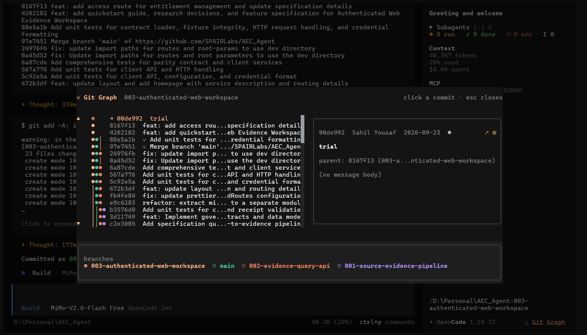

# opencode-git-graph

**Colour-coded git commit graph for the OpenCode TUI.**

Opens a dialog with a vertical git-log lane graph, commit list, and a right-hand detail pane. Works as a **TUI plugin** for OpenCode.



---

## What you get

- **Lane graph** with branch colours; current branch lane uses the theme primary colour
- **Stable lanes** - column order and colours persist across branch switches (first-seen order per repo, not "current branch first")
- **HEAD marker** - the current commit shows `◉` in the graph and `→ short-sha` in the list; detached HEAD shows `HEAD → sha` in the header and a `detached@sha` lane
- **Collapsed refs** - branches that share the same history draw one lane; the tip shows `×N` and the legend/detail show `name +N`
- **Worktree badges** - lanes checked out in a worktree show `⌂` on the tip, colour-coded per worktree (primary for the current worktree); detached worktrees badge the lane that contains their HEAD sha
- **Merge visibility** - `⑂` badge, horizontal bridge in the graph; detail pane lists `first:` / `merged:` parents and the **merge-base**
- **Click a commit** → message, parents, merge-base, author/date on the right (graph stays left)
- **Legend toggle** - press **`w`** or click the **branches** / **worktrees** tabs in the bottom panel
- **↗** open unified diff in your IDE / default diff viewer
- Scroll arrows (▲/▼) for the commit list and message; **wheel** over the detail pane scrolls the message; **⇧↑/⇧↓** also scroll it
- Auto-refresh on session/file/git events plus a periodic fallback
- Sidebar footer shows path:branch, OpenCode version, and a **⑂ Git Graph** shortcut (alongside the built-in footer content)

---

## Install (any PC with OpenCode)

### CLI (recommended)

```bash
opencode plugin -g opencode-git-graph
```

Then restart OpenCode. (`-g` writes global config; omit for project-local `.opencode/tui.json`.)

### Config file

Add the plugin to `~/.config/opencode/tui.json` (Windows: `C:\Users\<user>\.config\opencode\tui.json`):

```json
{
  "$schema": "https://opencode.ai/tui.json",
  "plugin": ["opencode-git-graph"]
}
```

Restart OpenCode after editing. The package is downloaded into OpenCode's plugin cache on startup.

### Open the graph

- Command palette: `git-graph.open` or slash command `/gitgraph`
- Or click **⑂ Git Graph** in the sidebar footer

If you previously installed the local file plugin (`./plugins/git-graph.tsx`), remove that entry when adding the npm package - both use id `git-graph` and the second is rejected as a duplicate.

---

## Configuration (environment variables)

| Variable | Default | Description |
| --- | --- | --- |
| `OPENCODE_GIT_GRAPH_COMMITS` | `10` | Commits shown per branch |
| `OPENCODE_GIT_GRAPH_BRANCHES` | `8` | Branches shown (most recently committed first) |
| `OPENCODE_GIT_GRAPH_REFRESH_MS` | `3000` | Periodic refresh interval |

---

## Requirements

- OpenCode >= 1.14.50
- `git` available on `PATH`

## License

MIT © 2026 Sahil Yousaf

See [LICENSE](./LICENSE).
